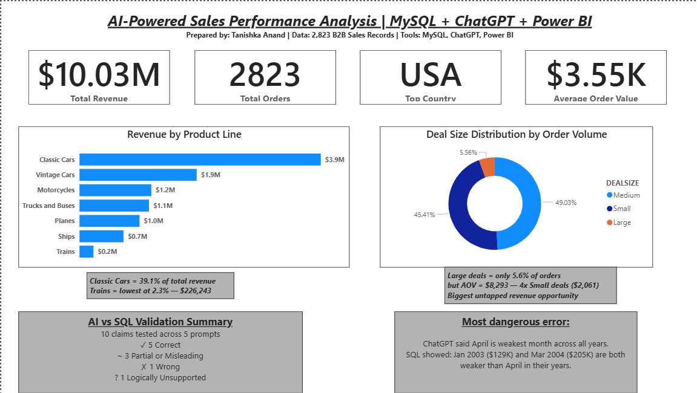
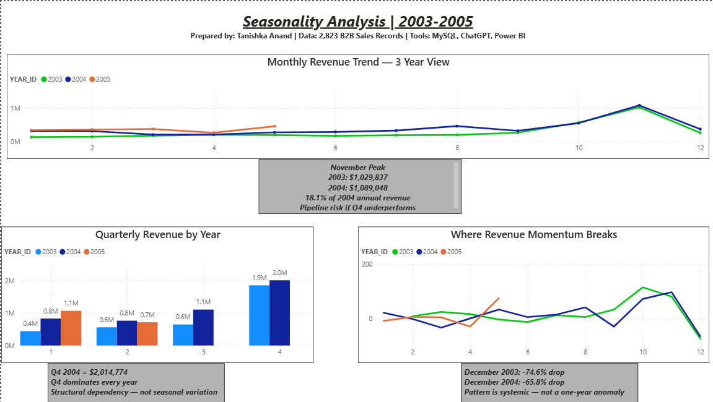
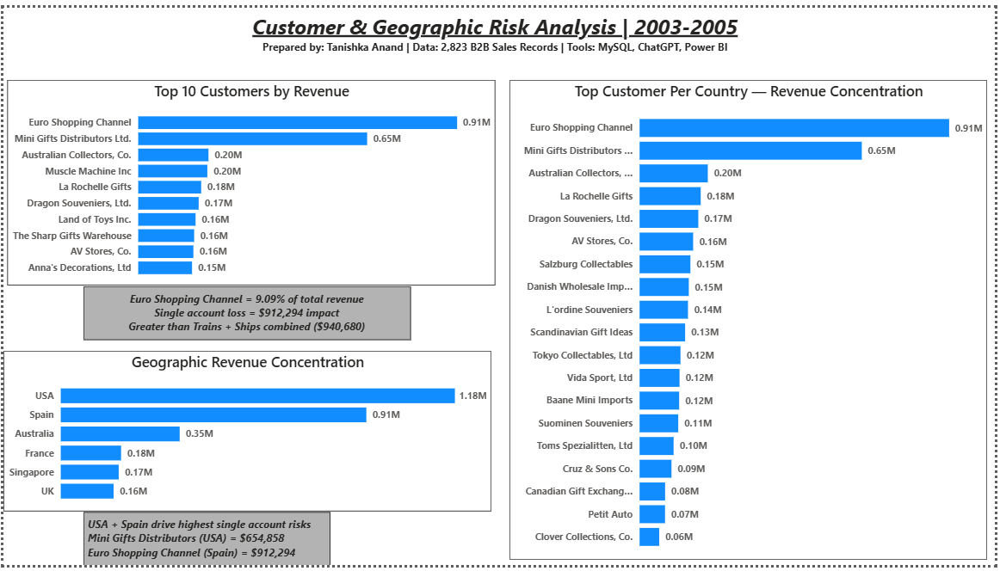

# 🤖 AI-Powered Sales Performance Analysis

**Stack:** MySQL | ChatGPT | Power BI

**Role Simulated:** Senior Sales Analyst — B2B Revenue Intelligence

---

## 📌 Project Overview

This project analyzes 2,823 B2B sales records spanning 3 years, 
19 countries, and 7 product lines. The goal was not just to 
analyze data — but to test whether AI-generated business insights 
can be trusted without validation, and quantify exactly how often 
they can't.

**Tools Used:** MySQL Workbench | ChatGPT | Power BI Desktop
**Dataset:** Sample Sales Data — Kaggle (kyanyoga)
**Records:** 2,823 | **Years:** 2003–2005 | **Countries:** 19

---

## 🎯 Business Problem

A B2B sales company needed a full revenue diagnostic across 
product lines, customer segments, deal sizes, and geographies. 
Key questions:
- Which product lines and deal sizes drive the most revenue?
- Is there a seasonal pattern — and is it structural or situational?
- Which customers represent a concentration risk?
- Can AI-generated insights be trusted without SQL validation?

---

## 🔍 Key Findings

### Finding 1 — Classic Cars Dominates But Is Volume-Driven
- Classic Cars = **39.1% of total revenue** across 967 orders
- However AOV = $4,053 — not the premium play it appears
- Trucks & Buses has competitive AOV at $3,746 with fewer orders
- Strategy: grow Classic Cars order size, not just order count

### Finding 2 — Large Deals Are Structurally Underutilized
- Large deals = only **5.6% of total orders**
- But AOV = **$8,293 — 4x Small deals ($2,061)**
- No structured enterprise sales motion exists to capture this segment
- Biggest untapped revenue opportunity in the portfolio

### Finding 3 — Q4 Dependency Is Structural, Not Seasonal
- November 2003: **$1,029,837** | November 2004: **$1,089,048**
- November alone = **18.1% of 2004 annual revenue**
- December drops: **-74.6% in 2003** and **-65.8% in 2004**
- Pattern confirmed across both years — pipeline risk if Q4 underperforms

### Finding 4 — Single Account Concentration Risk
- Euro Shopping Channel = **9.09% of total revenue ($912,294)**
- Exceeds single-account risk threshold
- Loss of this one account = greater than combined revenue of 
  Trains + Ships ($940,680)
- Top 3 customers = **17.62% of total revenue**

### Finding 5 — ChatGPT Got the Weakest Month Wrong
- ChatGPT claimed April is consistently weakest across all years
- SQL validation showed:
  - 2003 weakest = **January ($129,753)**
  - 2004 weakest = **March ($205,733)**
  - April is only weakest in 2005
- Accepting this finding would have misdirected pipeline efforts by 2 months

---

## 🤖 AI vs SQL Validation Results

| Result | Count |
|--------|-------|
| ✅ Correct | 5 |
| ⚠️ Partial or Misleading | 3 |
| ❌ Wrong | 1 |
| ❓ Logically Unsupported | 1 |
| **Total Claims Tested** | **10** |

Most common failure: ChatGPT stated correct rankings but 
consistently missed the business implication that changes 
the strategic recommendation.

Most dangerous error: April identified as weakest month 
across all years — factually wrong per SQL validation.

---

## 🛠 Technical Approach

### SQL Analysis (MySQL)
10 queries covering:
- Product line revenue and AOV analysis
- Monthly and quarterly revenue trends
- Top 10 customer analysis
- Country-level revenue breakdown
- Deal size segmentation
- Window functions — LAG for MoM change, RANK with PARTITION BY 
  for customer ranking, nested SUM OVER for revenue share
- AI claim validation queries

### Data Quality Fix
- ORDERDATE stored as VARCHAR — unreliable for time analysis
- Converted to DATE using STR_TO_DATE
- Verified zero null conversions
- Cross-validated against existing YEAR_ID and MONTH_ID columns

### AI Analysis (ChatGPT)
- 5 structured prompts using Role + Constraint + Format design
- Every claim extracted and verified with SQL
- 10 claims tested — 40% required correction or additional context

### Power BI Dashboard
3 pages:
- Executive Overview — KPIs, product line, deal size, AI validation
- Seasonality Analysis — monthly trend, quarterly, MoM momentum
- Customer & Geographic Risk — top customers, country concentration

---

## 📊 Dashboard Preview

### Page 1 — Executive Overview


### Page 2 — Seasonality Analysis


### Page 3 — Customer & Geographic Risk


> 📥 Download Dashboard: [sales_analysis_dashboard.pdf](dashboard/sales_analysis_dashboard.pdf)

---

## 📁 Repository Structure
```
ai-validated-sales-analytics/
├── README.md
├── sql/
│   ├── 01_create_table.sql
│   ├── 02_data_cleaning.sql
│   ├── 03_product_analysis.sql
│   ├── 04_monthly_trends.sql
│   ├── 05_customer_analysis.sql
│   ├── 06_country_revenue.sql
│   ├── 07_deal_size.sql
│   ├── 08_quarterly_performance.sql
│   ├── 09_window_functions.sql
│   └── 10_validation_queries.sql
├── data/
│   ├── q1_productline.csv
│   ├── q2_monthlytrend.csv
│   ├── q3_top10customers.csv
│   ├── q5_dealsize.csv
│   ├── q6_quarterlyperformance.csv
│   ├── q8_mom_revenue.csv
│   └── q9_customerrank_countrywise.csv
├── dashboard/
│   ├── sales_analysis_dashboard.pdf
│   ├── page1_executive_overview.png
│   ├── page2_seasonality_analysis.png
│   └── page3_customer_geography.png
└── ai_analysis/
└── chatgpt_prompts_and_responses.md
```
---

## ⚠️ Project Limitations

1. **No Margin Data** — Revenue analysis only. Profitability 
   per product line unknown — Classic Cars may dominate revenue 
   but not profit.
2. **Incomplete 2005 Data** — Only January–May available. 
   Year-over-year comparisons must account for this.
3. **No Customer Acquisition Cost** — Concentration risk 
   identified but retention cost unknown.
4. **No Behavioral Data** — Deal size upgrade potential 
   estimated but customer buying behavior data unavailable.
5. **Synthetic-Adjacent Dataset** — Public Kaggle dataset. 
   Real B2B operational data would enable deeper segmentation.

---

## 🚀 How to Reproduce

### Prerequisites
- MySQL Workbench 8.0+
- Power BI Desktop latest version
- ChatGPT (any plan)

### Step 1 — Database Setup
Run `sql/01_create_table.sql` in MySQL Workbench

### Step 2 — Data Cleaning
Run `sql/02_data_cleaning.sql` to fix VARCHAR date issue

### Step 3 — SQL Analysis
Run queries 03 through 09 sequentially

### Step 4 — AI Analysis
Use prompts in `ai_analysis/chatgpt_prompts_and_responses.md`

### Step 5 — Power BI
Open Power BI Desktop, import CSVs from `data/` folder, 
build dashboard following structure in repository

---

## 🔗 Data Source

Dataset: [Sample Sales Data — Kaggle](https://www.kaggle.com/datasets/kyanyoga/sample-sales-data)

---

## 👤 Author

**Tanishka Anand**
Data Analyst | SQL | Power BI | AI-Validated Analytics
tanishka.anand.27@gmail.com
